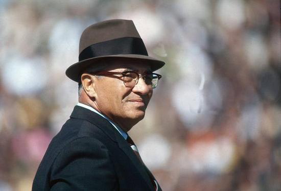

# UI Lab: Painting By Numbers

> Perfection is not attainable, but if we chase perfection we can catch excellence. ~[Vince Lombardi](https://en.wikipedia.org/wiki/Vince_Lombardi)

## Learning Objectives - The student should be able to...

* Complete this lab

## Paints: A Primer

Have you ever mixed two colors of paint together? You get a different color, right? In this lab, you will be mixing two colors of paint together to produce another color.

Artists often use _primary_ colors to produce _secondary_ colors. Primary colors are ones that can easily be mixed together to produce other colors. For example, you can mix red and blue together to make purple, or yellow and red together to make orange. Here is a table showing a primary color along the top and left side, and what colors they produce when mixed:

<table>
<tr>
<th></th>
<th>Red</th>
<th>Yellow</th>
<th>Blue</th>
</tr>
<tr>
<th>Red</td>
<td>Red</td>
<td>Orange</td>
<td>Purple</td>
</tr>
<tr>
<th>Yellow</th>
<td>Orange</td>
<td>Yellow</td>
<td>Green</td>
</tr>
<tr>
<th>Blue</th>
<td>Purple</td>
<td>Green</td>
<td>Blue</td>
</tr>
</table>

In this lab, you will be implementing this logic to update an app UI to display these different colors.

## App

Specifically, you are tasked with producing a user interface for an app that looks like this:

The user can select different options in order to show different colors in the paint bucket. For example, selecting **Blue** and **Yellow** would produce this:

Selecting **Blue** and **Red** would show this:

You get the idea by now.

As in previous labs, some parts of this app have already been written for you, but you will need to fill in the missing parts in order for the application to work. Open up the Xcode project provided by in this repo from `UIFun/UIFun.xcodeproj` and check out what has been given to you.

### Starting Off

The project contains a barebones (and barely functional) view controller, in `ViewController.swift`. You'll see that several parts have been marked as `TODO`. This indicates the parts of the code that _you_ have to fill in yourself.

`Main.storyboard` contains a single scene. That scene already has a view, the paint bucket. The segmented controls have not been created for you yet. No IB outlets have been set up for you, either, and no UI elements have been connected to the IB action declared in `ViewController.swift`, either.

Time to get started!

### Your Tasks

Here is what you need to accomplish to get this application working. Before you start, though, make sure to read through this entire lab, as there are some helpful hints and notes at the end that should make your task a lot easier.

1. Create an _IB outlet_ to the paint bucket view. (This outlet should be of type `UIView`.) Connect it to the paint bucket.
2. Add the two segmented controls below the paint bucket view.
3. Create and connect an _IB outlet_ to the first segmented control. This should be of type `UISegmentedControl`.
4. Create and connect another _IB outlet_ to the second segmented control. This should also be of type `UISegmentedControl`.
5. Connect _both_ segmented controls to the `colorSelected(_:)` _IB action_ already declared in `ViewController.swift`. You should notice something interesting here: More than one UI element can have the _same_ action. That is, you can connect _two_ segmented controls to `colorSelected(_:)`. You haven't seen this happen in previous labs, but this is totally fine, and, in fact, frequently happens in iOS interfaces.
6. `colorSelected(_:)` is called whenever the user presses one of the buttons in either segmented control. You should write some logic to get the color selected by _each_ control, "mix" them together to produce a new color, and then update the paint bucket to display the mixed color.
6. Your view controller has a method stubbed out named `mixColors(withFirst:second:)`. Write the logic in this method to mix both the `first` and `second` colors together. This method should return a `String` with the name of the new color ("red", "purple", "green", etc.). You'll have to drawn on your knowledge of if/else statements and switch statements from previous units to complete this method.

### Notes & Hints

A few pieces of code have been provided for you to make this lab a bit easier.

1. You can call `color` on a segmented control to get its selected color.
2. You can call `name` on a color to get the name of the color, as a string.
3. You can combine \#1 and \#2 to get the name of a color represented by a segmented control. For example, given a segmented control named `sender`, you can call `sender.color.name` to get the name of its selected color.
4. You can set the color of a view, such as the paint bucket view, with a string using `paintColorName`. For example, if your paint bucket's IB outlet is named `paintBucket`, you can use `paintBucket.paintColorName = "red"` to set the paint color to red.
5. You can also get the current paint color name by calling `paintBucket.paintColorName` (if `paintBucket` is your IB outlet to the paint bucket).

You should be able to combine all these hints, along with the existing code, to complete this lab. Good luck! Don't forget to build and run your app _often_. Don't try to complete the lab all in one go! If you make a mistake or introduce a bug, it will be much easier to track down the source of the problem if you are frequently testing your app. Tackle the problem in small chunks, and feel free to add your own `print()` statements along the way to see what your code is doing.

<a href='https://learn.co/lessons/UILab02' data-visibility='hidden'>View this lesson on Learn.co</a>
